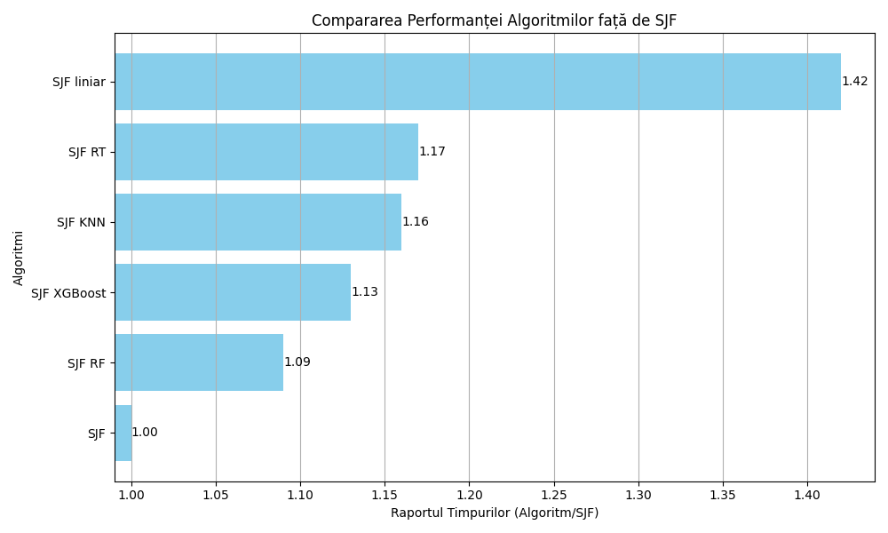

# Scheduling Solution using Machine Learning

## Introduction

### Importance of the Scheduler

Scheduling algorithms play a crucial role in the efficient operation of computing systems. Enhancing the efficiency of these systems has significant financial implications, especially in the ever-expanding field of "Cloud Computing". An efficient scheduler is essential for the proper allocation of computing resources for process execution. The faster the server responds, the more requests it can handle, directly leading to increased company revenue.

The importance of this subject is underscored by ongoing innovations in research. One area of interest is the development of energy-efficient algorithms, aimed at maintaining performance while reducing operational costs. Another focus is on evaluating the performance of existing algorithms.

It is noteworthy that from 2007 to 2023, the Linux kernel used the "Completely Fair Scheduler". This was recently replaced by the "EEVDF" algorithm. Although the concept of the "EEVDF" algorithm was published as early as 1995, its integration into the Linux kernel highlights the continued relevance of this topic.

### Problem Definition

For the efficient functioning of operating systems, each process needs to receive runtime on the processor. The way processes are selected for execution is determined by a scheduling algorithm. The algorithm's role is to optimally distribute the processor's resources to each process, with the objective of maximizing performance and minimizing response time. Most scheduling algorithms implemented in modern operating systems are based on heuristics. These heuristics are empirical rules or principles that attempt to predict the runtime of a process based on its history or predefined characteristics. While heuristics are relatively simple and quick to implement, they are not always accurate. To improve prediction accuracy and scheduling efficiency, this paper proposes the introduction of machine learning methods in place of heuristic estimates.

### Solution Overview

The proposed solution involves training several regression models from the field of machine learning to estimate the runtimes of processes. The regression models used for testing the hypothesis include Linear Regression, KNN, Regression Tree, Random Forests, and XGBoost. Although all models provided promising results in predicting runtimes, some models exhibit shorter inference times, a crucial attribute for a scheduling algorithm.

Multiple versions of the "Shortest-Job-First" (SJF) algorithm will be tested, where the selection of processes from the waiting queue will be based on the runtimes predicted by the regression models. The algorithm will be non-preemptive, meaning that a process will complete its execution regardless of the model's prediction. Poor predictions will be penalized by the nature of the SJF algorithm, where failure to adhere to the order given by the "real" process times will automatically increase the average turnaround time.

The performance metric for evaluating the enhanced scheduling algorithm with machine learning model predictions will be compared to the optimal algorithm, specifically the "Shortest-Job-First" with known apriori runtimes.

The ultimate objective is to integrate and test a robust and accurate model in a server environment. The process runtimes on a server exhibit greater variability than on a personal system.

---

## Table of Contents

1. [Introduction](#introduction)
2. [Problem Definition](#problem-definition)
3. [Solution Overview](#solution-overview)
4. [Installation](#installation)
5. [Usage](#usage)
6. [Results](#results)
7. [Contributing](#contributing)
8. [License](#license)

## Installation

To install the necessary dependencies, run:

```bash
pip install -r requirements.txt
```

Download the data from the following link:
http://gwa.ewi.tudelft.nl/fileadmin/pds/trace-archives/grid-workloads-archive/datasets/gwa-t-1/anon_jobs_sqlite.zip

or use the following command:

```bash
wget http://gwa.ewi.tudelft.nl/fileadmin/pds/trace-archives/grid-workloads-archive/datasets/gwa-t-1/anon_jobs_sqlite.zip

unzip anon_jobs_sqlite.zip
```

## Usage

1. Train the machine learning models by modifying the source code, just choosing model and size of sample, and run:

```bash
python3 make_predictions.py
```

2. Go to through the source code of SJF.py and evaluate the performance by running:

```bash
python3 SJF.py
```

## Results

In this section, results from the simulations will be presented, including tables and charts that illustrate the performance of each algorithm compared to the SJF baseline.

Performance Comparison Table:

### Performance Comparison Table:

| Algorithm                | Average Execution Time [ms] | Time Ratio (Algorithm/SJF) |
|--------------------------|-----------------------------|----------------------------|
| SJF                      | 51818.34                    | **1.00**                   |
| SJF with RF Prediction   | 56861.81                    | **1.09**                   |
| SJF with XGBoost Prediction | 58500.82                | **1.13**                   |
| SJF with KNN Prediction  | 59955.40                    | **1.16**                   |
| SJF with RT Prediction   | 60453.30                    | **1.17**                   |
| SJF with Linear Prediction | 73755.88                 | **1.42**                   |


### Performance Comparison Chart:



## Contributing

Contributions are welcome! Please fork this repository and submit a pull request for any enhancements or bug fixes.

## License

This project is licensed under the MIT License - see the [LICENSE](./LICENSE) file for details.